<div align="center">
  
</div>

<br/>

## License

[](https://opensource.org/licenses/MIT)

This project is licensed under the MIT License — see the [LICENSE](LICENSE) file for details.

<br/>

## Table of Contents

- [Overview](#overview)
- [Tech Stack](#tech-stack)
- [Project Structure](#project-structure)
- [System Design](#system-design)
- [Features](#interesting-features)
- [User Screens](#user-screens)
- [Optimizations](#optimizations)
- [Development & Testing](#tests)
- [Deployment](#deployment-map)

<br/>

<!-- project overview -->
<div id="overview" align="center">
  
</div>
<br/>

> **TravelWise** is a smart travel companion that creates personalized trips, helps users discover hidden gems and local culture, and avoid tourist traps.
> It also lets travelers share experiences, making every journey easier and more enjoyable.

<br/>

## Project Structure

```bash
TravelWise/
├── backend/            # Express.js API + Prisma ORM
├── frontend/           # React Native Expo Application
├── AdminDashboard/     # React + Vite Web Dashboard
├── n8n/                # Workflow Automation Services
└── readme/             # Documentation Assets
```

<br/>

<!-- System Design -->
<div align="center">
  
</div>

### System Design

<div align="center">
  
</div>

<br/>

### Backend Architecture

The backend is built using a **Modern Modular Architecture** that prioritizes **Separation of Concerns**, **Scalability**, and **Maintainability**. Instead of grouping files by type (controllers, services, etc.), I grouped them by **Module** (e.g., Auth, Itinerary, User) to keep related logic independent, inspired by the [Repository Pattern](https://blog.alexrusin.com/clean-architecture-in-node-js-implementing-the-repository-pattern-with-typescript-and-prisma/).

<div align="center">
  
</div>

<br/>

### Entity Relationship Diagram

<div align="center">
  
</div>

<br/>

### TravelWise AI Agent

<a href="./readme/diagrams/AI_Agent.png">
  
</a>

<br/>

### n8n Workflow

<div align="center">
  
</div>

<br/>

<!-- Project Highlights -->
<div align="center">
  
</div>

### Interesting Features


<br/>

<!-- User Screens -->
<div align="center">
  
</div>

### User Screens

#### Authentication

<table align="center" width="100%">
  <tr>
    <th width="33%">Login</th>
    <th width="33%">Register</th>
    <th width="33%">Email<br/>Verification</th>
  </tr>
  <tr>
    <td></td>
    <td>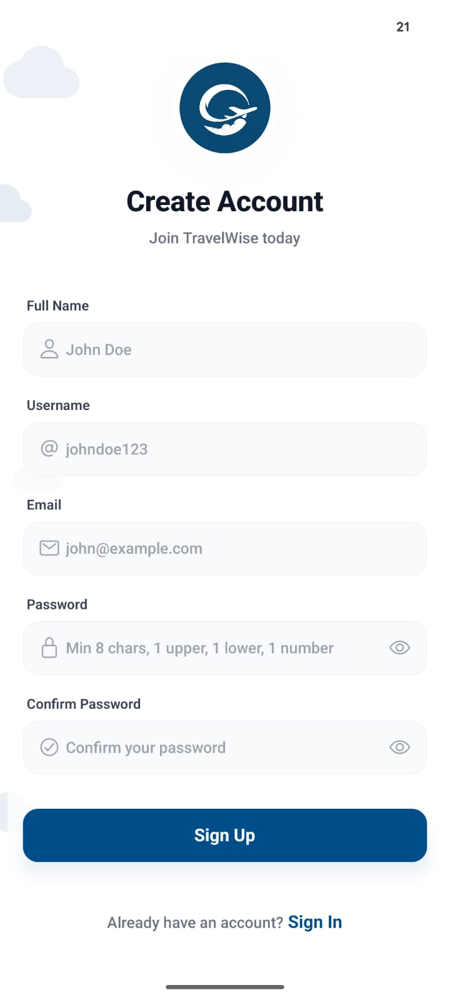</td>
    <td></td>
  </tr>
</table>

<br/>

#### Feed & Activity

<table align="center" width="100%">
  <tr>
    <th width="33%">User Feed</th>
    <th width="33%">Notifications</th>
    <th width="33%">Chat</th>
  </tr>
  <tr>
    <td>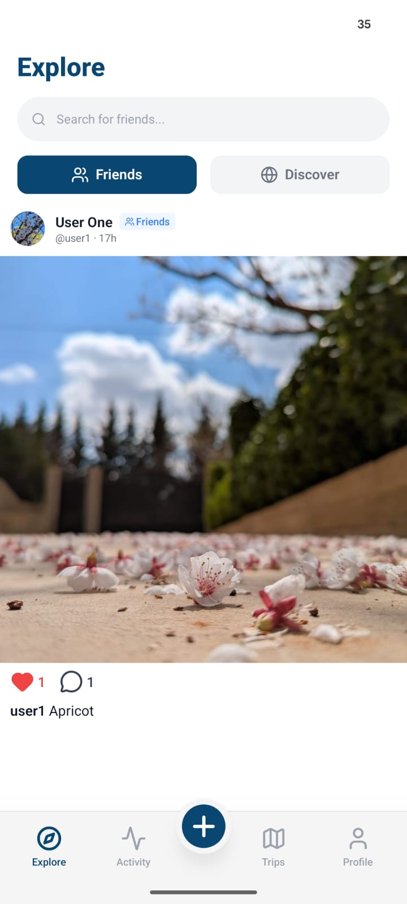</td>
    <td>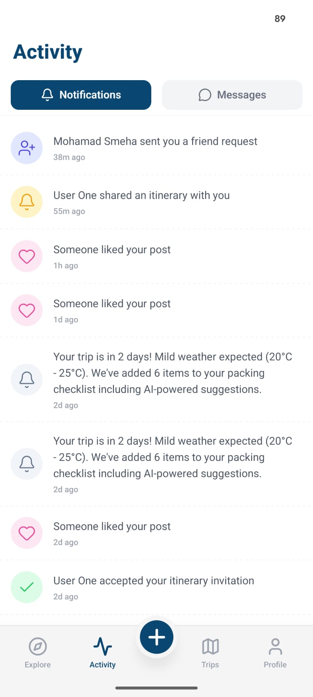</td>
    <td>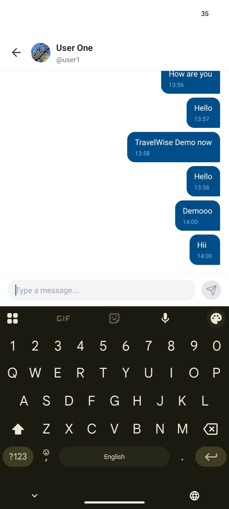</td>
  </tr>
</table>

<br/>

#### Itinerary

<table align="center" width="100%">
  <tr>
    <th width="33%">Trip Map</th>
    <th width="33%">Hidden Gem Details</th>
    <th width="33%">Itinerary Details</th>
  </tr>
  <tr>
    <td>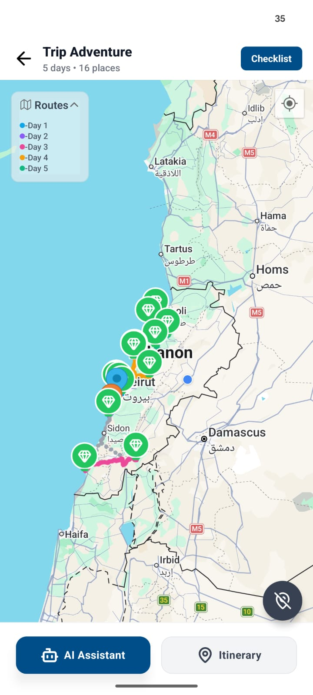</td>
    <td>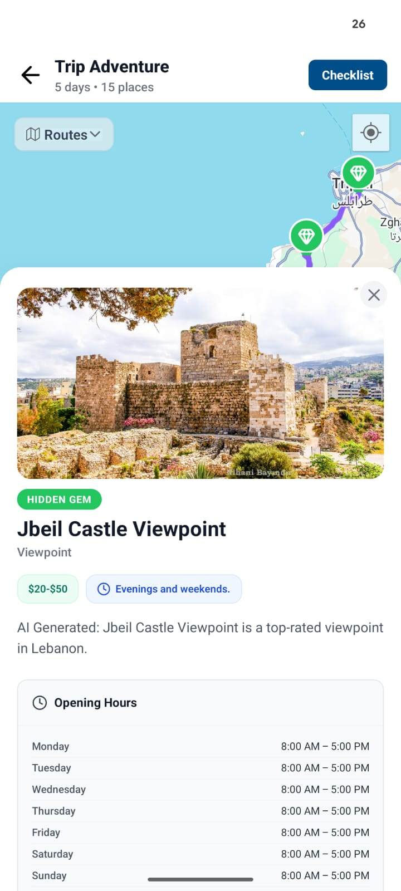</td>
    <td>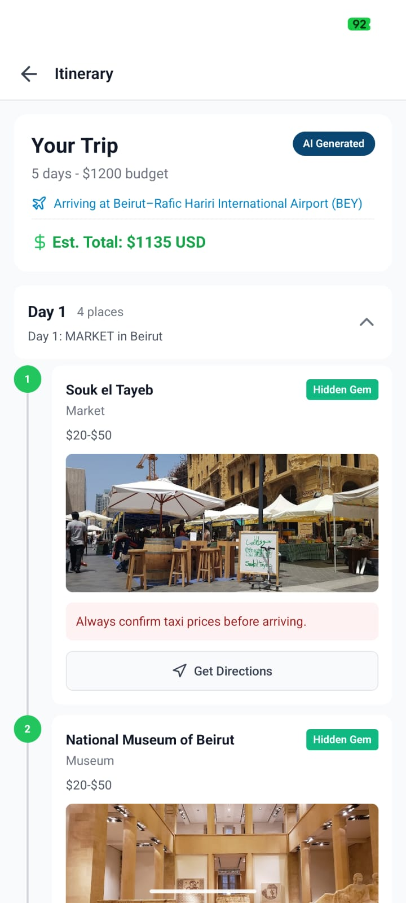</td>
  </tr>
</table>

<br/>

### Application Demo

<table align="center" width="100%">
  <tr>
    <th width="33%">Login & Onboarding</th>
    <th width="33%">Gmail Verification</th>
    <th width="33%">Creating Post</th>
  </tr>
  <tr>
    <td></td>
    <td></td>
    <td></td>
  </tr>
</table>

<br/>

<table align="center" width="100%">
  <tr>
    <th width="33%">Live Location & Gems</th>
    <th width="33%">GPS Sharing</th>
    <th width="33%">AI Chatbot</th>
  </tr>
  <tr>
    <td></td>
    <td></td>
    <td>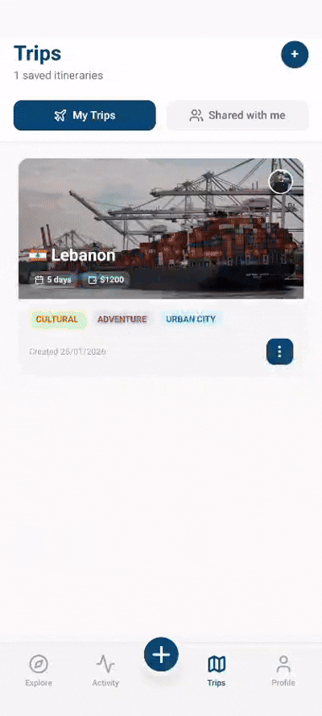</td>
  </tr>
</table>

<br/>

### Admin Dashboard

<table align="center" width="100%">
  <tr>
    <th width="33%">Admin Login</th>
    <th width="33%">Dashboard Overview</th>
    <th width="33%">User Management</th>
  </tr>
  <tr>
    <td></td>
    <td></td>
    <td>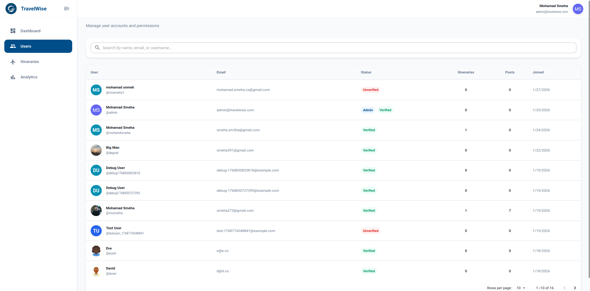</td>
  </tr>
</table>

<br/>

<!-- Development & Testing -->
<div align="center">
  
</div>

<br/>

### Optimizations

<div id="optimizations"></div>
<table align="center" width="100%">
  <thead>
    <tr>
      <th width="50%">Frontend</th>
      <th width="50%">Backend</th>
    </tr>
  </thead>
  <tbody>
    <tr>
      <td><strong>Memoization:</strong> Use <code>useMemo</code> & <code>useCallback</code> to prevent unnecessary re-renders.</td>
      <td><strong>API Caching:</strong> Use <code>node-cache</code> with TTL strategies for Google Places & Weather API responses.</td>
    </tr>
    <tr>
      <td><strong>Smart Caching:</strong> Use <strong>React Query</strong> for efficient server-state caching and background updates.</td>
      <td><strong>Database Indexing:</strong> Prisma <code>@@index</code> on frequently queried fields for faster queries.</td>
    </tr>
  </tbody>
</table>

### Tests

<table width="100%">
  <tr>
    <th>CI/CD</th>
  </tr>
  <tr>
    <td align="center">
      <a href="./readme/CI/CI-CD.png">
        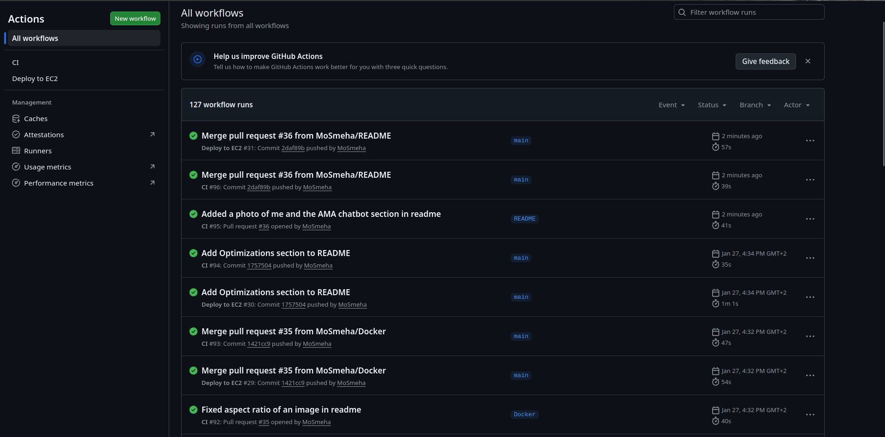
      </a>
    </td>
  </tr>
  <tr>
    <th>Unit Tests Using Vitest</th>
  </tr>
  <tr>
    <td align="center">
      <a href="./readme/CI/Passed_Tests.png">
        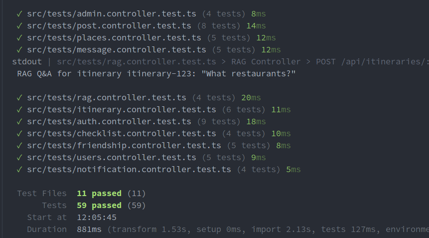
      </a>
    </td>
  </tr>
</table>

<br/>

<!-- Deployment -->
<div align="center">
  
</div>

### Deployment Map

| Deployment Flow                        |
| -------------------------------------- |
|  |

<br/>

| AWS EC2 Server Running                    |
| ----------------------------------------- |
| 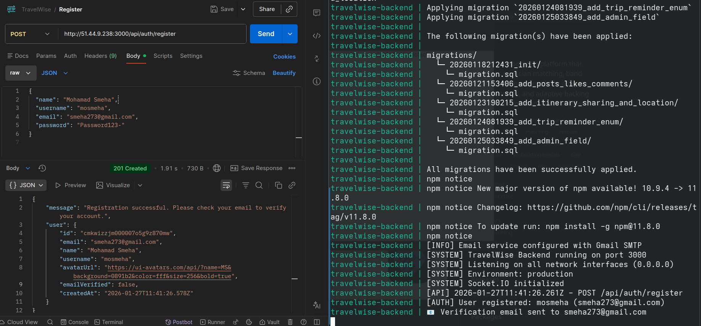 |

<br/>

### AMA Chatbot

Additionally, I made this chatbot to answer questions regarding me and my SE Factory experience. You can try it out [here](https://ama-chatbot.vercel.app/).  
Built with **Supabase**, **React**, and **Express**.

<div align="center">
  <a href="https://ama-chatbot.vercel.app/">
    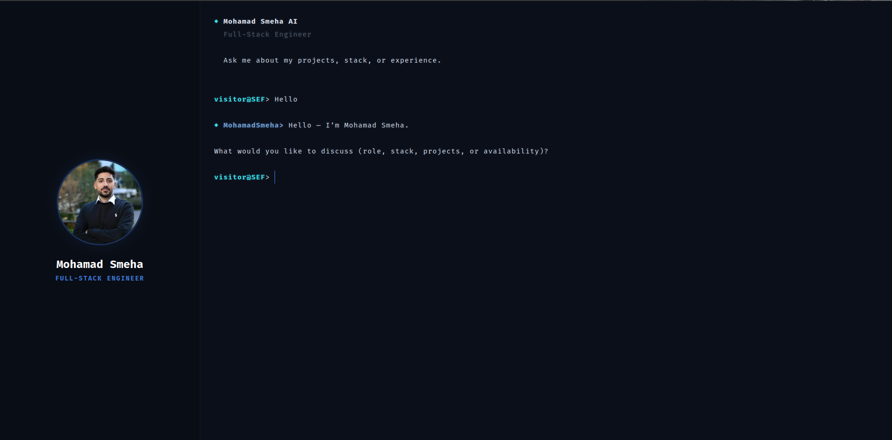
  </a>
</div>
