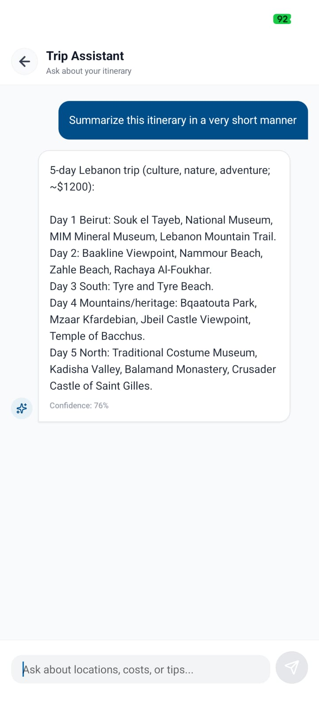
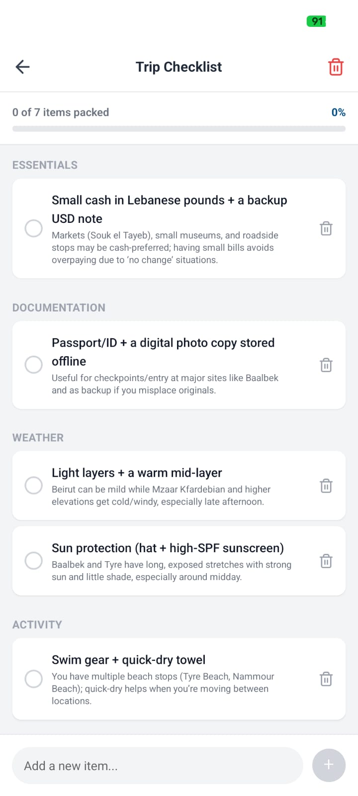
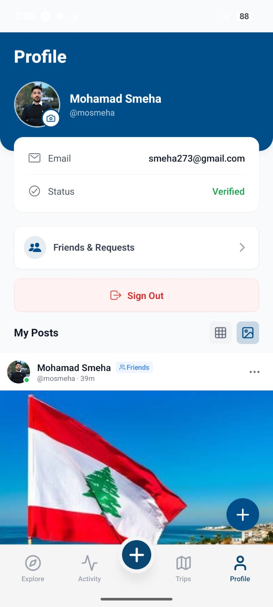
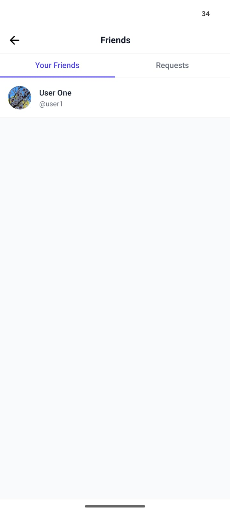

  

## License

This project is licensed under the MIT License - see the [LICENSE](LICENSE) file for details.

  

<!-- project overview -->

> **TravelWise** is a smart travel companion that creates personalized trips, helps users discover hidden gems and local culture, and avoid tourist traps.  
> It also lets travelers share experiences, making every journey easier and more enjoyable.

  

<!-- System Design -->

### System Design

### Entity Relationship Diagram

### n8n

  

<!-- Project Highlights -->

### Interesting Features

- **Smart Itinerary Planning**: Create detailed, personalized travel itineraries with just a few clicks.
- **Hidden Gem Discovery**: Find unique, off-the-beaten-path locations with our specialized cards.
- **Real-time GPS & Sharing**: Share live locations and itinerary routes with friends and family.
- **Community Posts**: Share your travel experiences and photos with the TravelWise community.
- **AI Travel Assistant**: Get instant answers and recommendations from our RAG-powered chatbot.
- **Interactive Checklists**: Keep track of your travel plans and to-dos in an organized way.

  

<!-- Demo -->

### User Screens

#### Authentication

  
  
  

#### Feed & Discovery

  
  

#### Communication

  
  

#### Itinerary, Map & AI

  
  
  
  

#### Profile

  
  
  

### Application Demo

  
  

  
  

  
  

  
  

### Admin Dashboard

  
    
  
    
  

