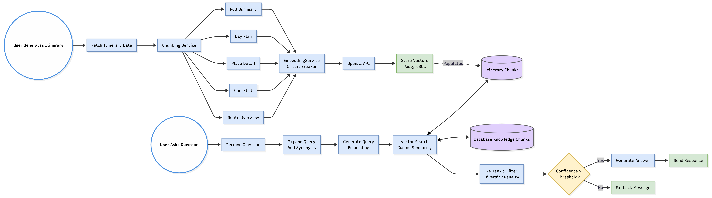
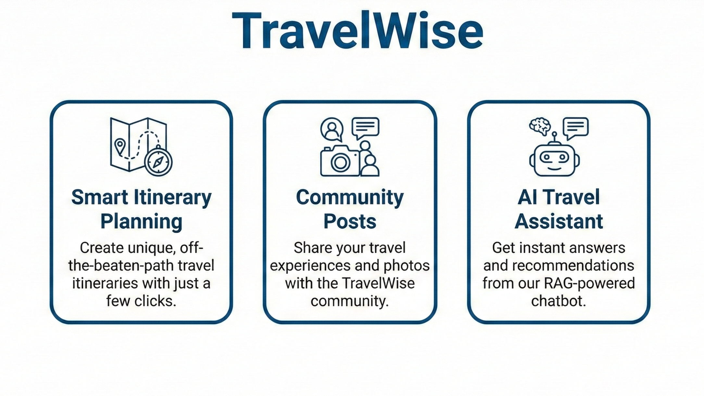
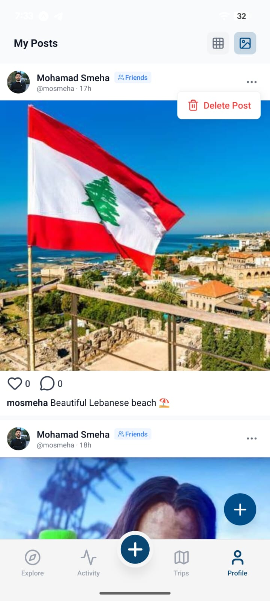
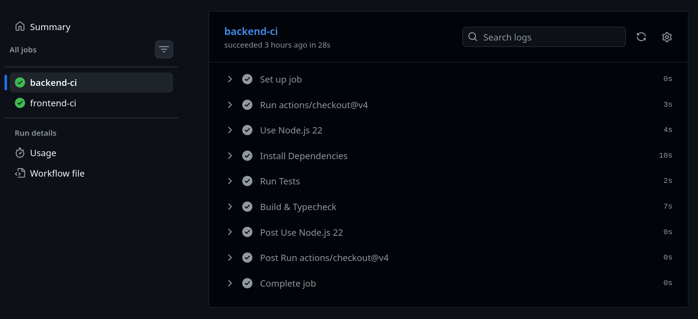

  

 

## License

This project is licensed under the MIT License — see the [LICENSE](LICENSE) file for details.

 

<!-- project overview -->

  

> **TravelWise** is a smart travel companion that creates personalized trips, helps users discover hidden gems and local culture, and avoid tourist traps.
> It also lets travelers share experiences, making every journey easier and more enjoyable.

 

<!-- System Design -->

  

### System Design

  

 

### Entity Relationship Diagram

  

 

### TravelWise AI Agent

 

### n8n Workflow

  

 

<!-- Project Highlights -->

  

### Interesting Features

* **Real-time GPS & Sharing** — Share live location and routes
* **Smart Weather Logistics** — Automated calendar updates and personalized packing lists adapted to real-time weather forecasts (powered by n8n)

### Feature Figure

 

<!-- User Screens -->

  

### User Screens

#### Authentication

<table align="center" width="100%">
  <tr>
    <th width="33%">Login</th>
    <th width="33%">Register</th>
    <th width="33%">Email Verification</th>
  </tr>
  <tr>
    <td></td>
    <td></td>
    <td></td>
  </tr>
</table>

 

#### Feed & Activity

<table align="center" width="100%">
  <tr>
    <th width="33%">User Feed</th>
    <th width="33%">Notifications</th>
    <th width="33%">Chat</th>
  </tr>
  <tr>
    <td></td>
    <td></td>
    <td></td>
  </tr>
</table>

 

#### Itinerary

<table align="center" width="100%">
  <tr>
    <th width="33%">Trip Map</th>
    <th width="33%">Hidden Gem Details</th>
    <th width="33%">Itinerary Details</th>
  </tr>
  <tr>
    <td></td>
    <td></td>
    <td></td>
  </tr>
</table>

 

#### Profile

<table align="center" width="100%">
  <tr>
    <th width="33%">User Profile</th>
    <th width="33%">Friends</th>
    <th width="33%">Profile Feed</th>
  </tr>
  <tr>
    <td></td>
    <td></td>
    <td></td>
  </tr>
</table>

 

### Application Demo

<table align="center" width="100%">
  <tr>
    <th width="33%">Login & Onboarding</th>
    <th width="33%">Gmail Verification</th>
    <th width="33%">Creating Post</th>
  </tr>
  <tr>
    <td></td>
    <td></td>
    <td></td>
  </tr>
</table>

 

<table align="center" width="100%">
  <tr>
    <th width="33%">Live Location & Gems</th>
    <th width="33%">GPS Sharing</th>
    <th width="33%">AI Chatbot</th>
  </tr>
  <tr>
    <td></td>
    <td></td>
    <td></td>
  </tr>
</table>

 

### Admin Dashboard

<table align="center" width="100%">
  <tr>
    <th width="33%">Admin Login</th>
    <th width="33%">Dashboard Overview</th>
    <th width="33%">User Management</th>
  </tr>
  <tr>
    <td></td>
    <td></td>
    <td></td>
  </tr>
</table>

 

<!-- Development & Testing -->

  

### Tests

<table width="100%">
  <tr>
    <th>CI</th>
  </tr>
  <tr>
    <td align="center">
      
    </td>
  </tr>
  <tr>
    <th>Testing</th>
  </tr>
  <tr>
    <td align="center">
      
    </td>
  </tr>
</table>

 

<!-- Deployment -->

  

### Deployment Map

| Deployment Flow                        |
| -------------------------------------- |
|  |
