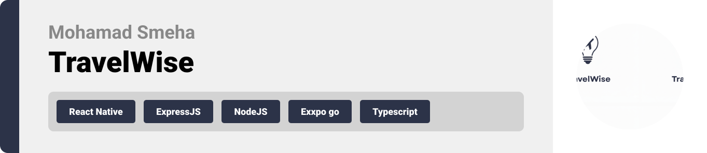
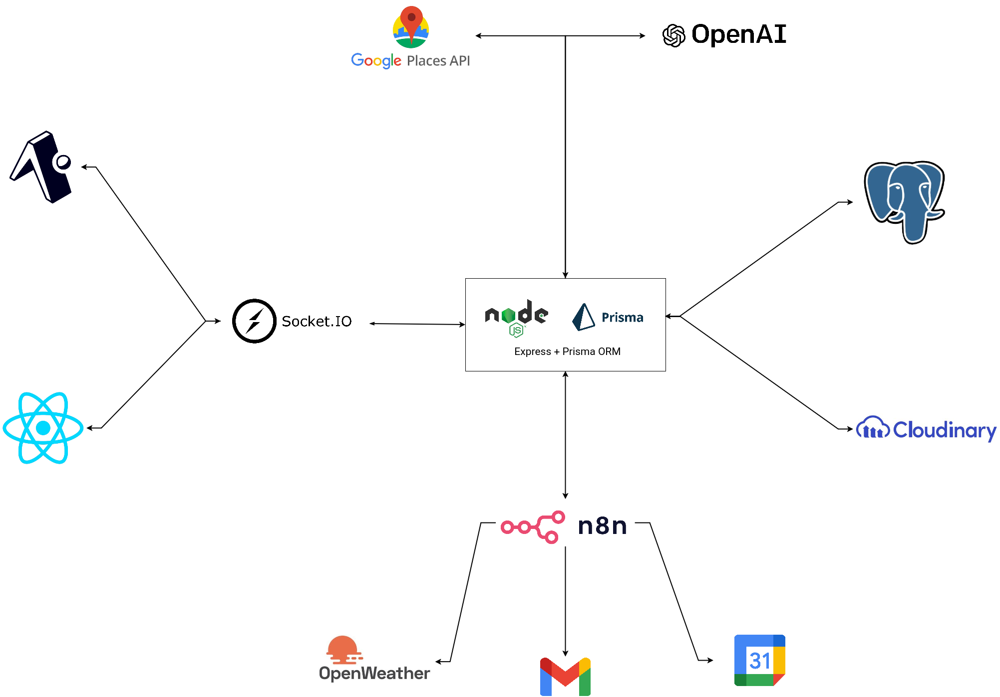
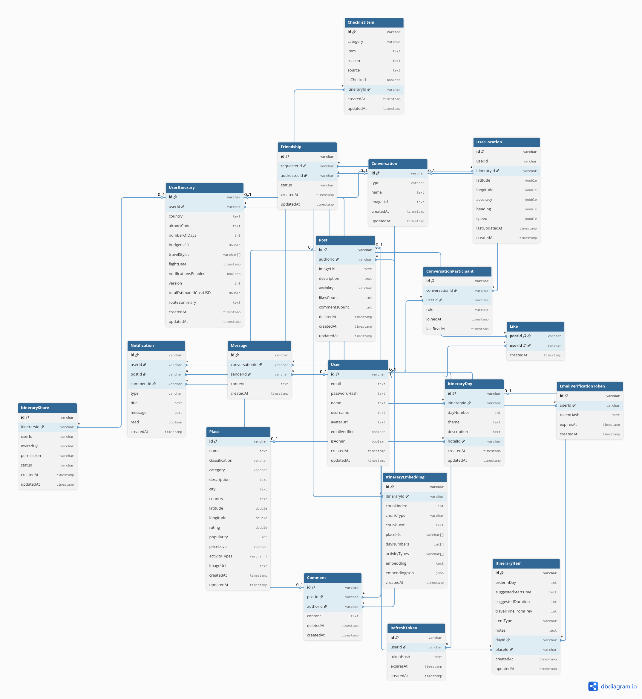
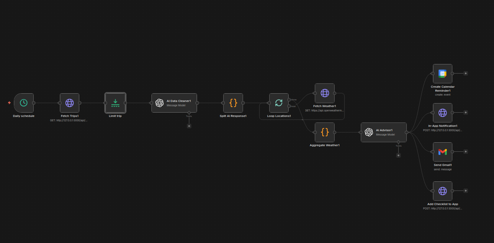
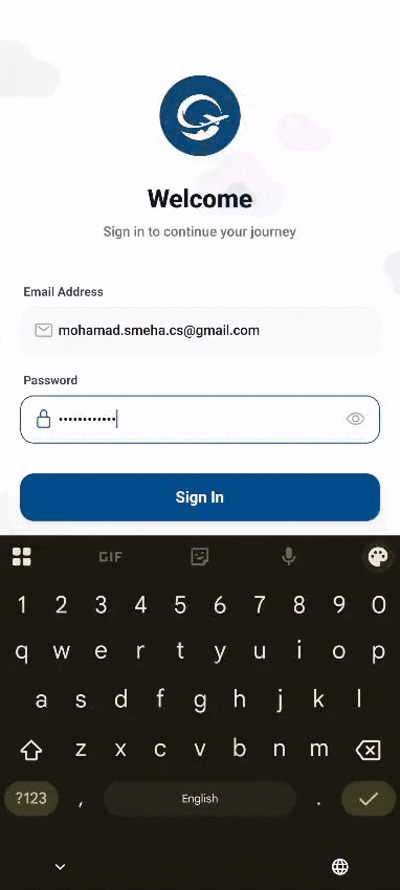
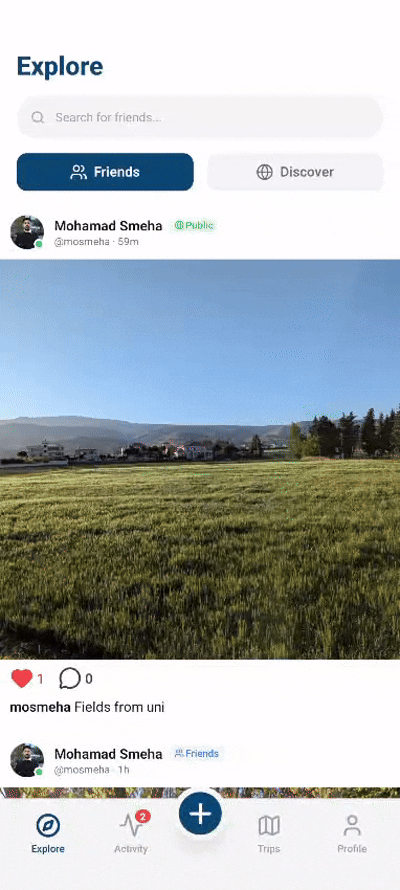

  

## License

This project is licensed under the MIT License - see the [LICENSE](LICENSE) file for details.

  

<!-- project overview -->

> TravelWise is a smart travel companion that creates personalized trips, helps users discover hidden gems and local culture, and avoid tourist traps. It also lets travelers share experiences, making every journey easier and more enjoyable.

  

<!-- System Design -->

### System Design

### Entity Relationship Diagram

### n8n

  

<!-- Project Highlights -->

### Interesting Features

- **Smart Itinerary Planning**: Create detailed, personalized travel itineraries with just a few clicks.
- **Hidden Gem Discovery**: Find unique, off-the-beaten-path locations with our specialized cards.
- **Real-time GPS & Sharing**: Share live locations and itinerary routes with friends and family.
- **Community Posts**: Share your travel experiences and photos with the TravelWise community.
- **AI Travel Assistant**: Get instant answers and recommendations from our RAG-powered chatbot.
- **Interactive Checklists**: Keep track of your travel plans and to-dos in an organized way.

  

<!-- Demo -->

### User Screens

| Login & Onboarding | Creating Itinerary | Creating Post |
| :---: | :---: | :---: |
|  |  |  |

| Live Location & Hidden Gems | GPS Sharing | AI Chatbot |
| :---: | :---: | :---: |
|  |  |  |

| User Profile | Notifications | Itinerary Details |
| :---: | :---: | :---: |
|  |  |  |

| Itinerary Checklist | Chat Demo |
| :---: | :---: |
|  |  |
