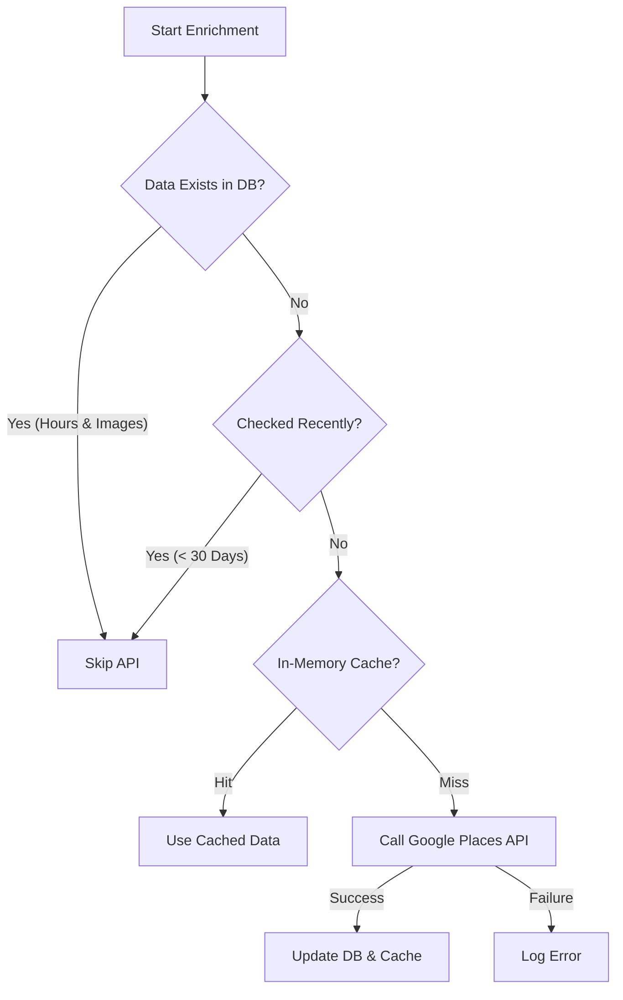

# Google Places API Optimization Strategy

This document outlines the multi-layered caching and optimization strategy used in TravelWise to minimize Google Places API costs while ensuring data freshness.

## Overview

When generating itineraries, the system enhances database locations with rich data from Google Places (images, ratings, opening hours). To prevent excessive API usage, we implement a strict **3-Layer Protection System**.

## The 3-Layer Protection System

### Layer 1: Database Validity Check (The "Staleness" Check)
**Goal:** Prevent re-fetching places that were recently checked, even if they returned no data.

Before making any request, the system checks the `Place` record in the database:
- **Condition:**
  1. Does the place already have `openingHours` AND `images`? -> **SKIP**
  2. Was the place checked in the last **30 days** (`lastEnrichedAt`)? -> **SKIP**

**Why this matters:**
Some places (e.g., neighborhoods, public squares) genuinely do not have opening hours. Without the "30-day check", the system would see missing data and retry the API call every time the server restarts (which clears the memory cache), leading to a "cost leak".

### Layer 2: In-Memory Deduplication (NodeCache)
**Goal:** Prevent duplicate requests for the exact same place within a short window (e.g., high traffic).

- **Mechanism:** `node-cache`
- **TTL (Time To Live):** 7 Days
- **Behavior:** If Layer 1 passes (meaning we *do* need to fetch), we check this memory cache. If a request was made 2 days ago, we return that result immediately without hitting Google.

### Layer 3: Circuit Breaker
**Goal:** Prevent cascading failures if Google API is down or slow.

- **Mechanism:** `opossum` circuit breaker.
- **Behavior:** If API calls fail repeatedly (e.g., 50% failure rate), the circuit "opens" and instantly fails subsequent requests without attempting to contact Google, allowing the system to degrade gracefully.

## Decision Flowchart

## Data Fields Managed

The enrichment process specifically targets:
- `googlePlaceId`: Stable identifier.
- `openingHours`: Structured weekly hours.
- `rating` & `totalRatings`: Social proof.
- `imageUrls`: Visual content.
- `lastEnrichedAt`: **Critical** timestamp for Layer 1 validity.

## Configuration

- **Enrichment Validity:** 30 Days (Hardcoded in `itinerary.service.ts`)
- **Cache TTL:** 7 Days (Configurable via `CACHE_TTL_PLACES`)
- **API Key:** `GOOGLE_PLACES_API_KEY` env variable.

. Implementation Phases
Phase 1: Add Socket.IO + Friend System (search, add, accept/reject)
Phase 2: Notification system (live + persistent)
Phase 3: 1:1 Direct messaging
Phase 4: Group chats
Phase 5: Itinerary invitations
Phase 6: Image posts (Instagram-like feed)
